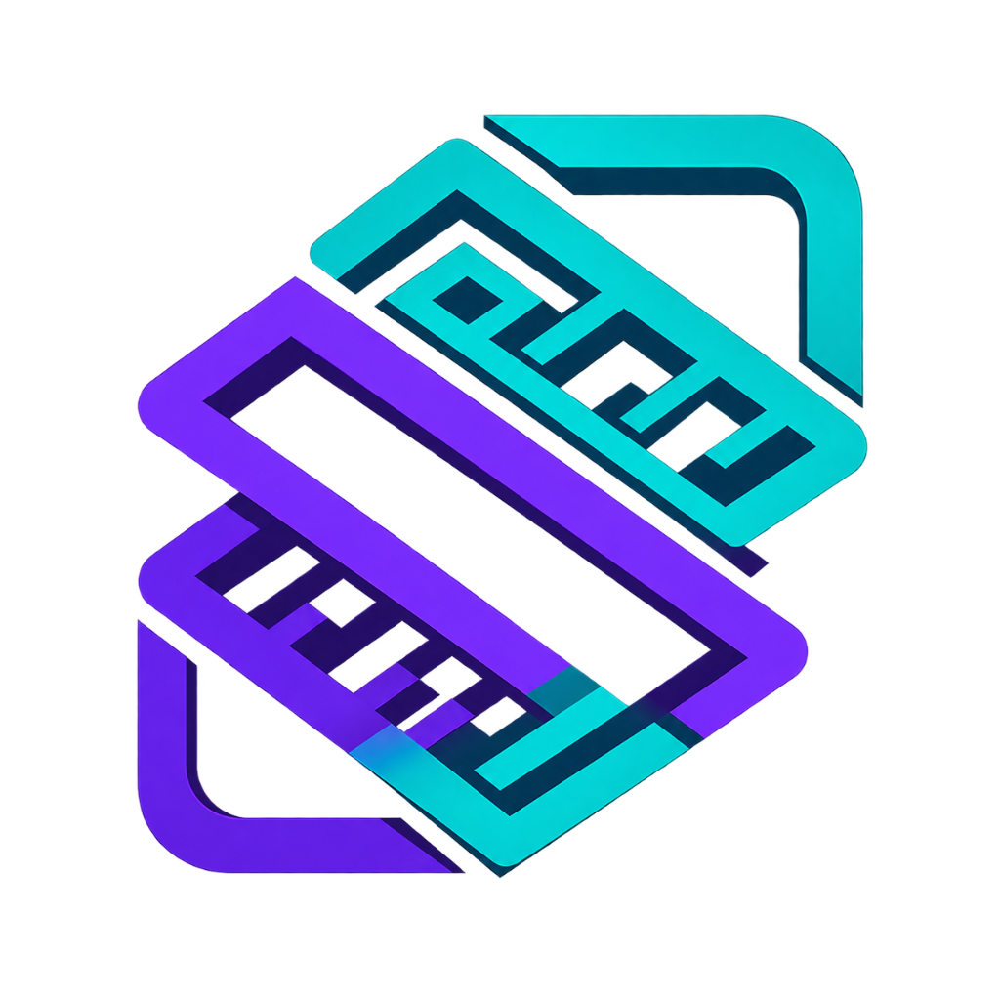
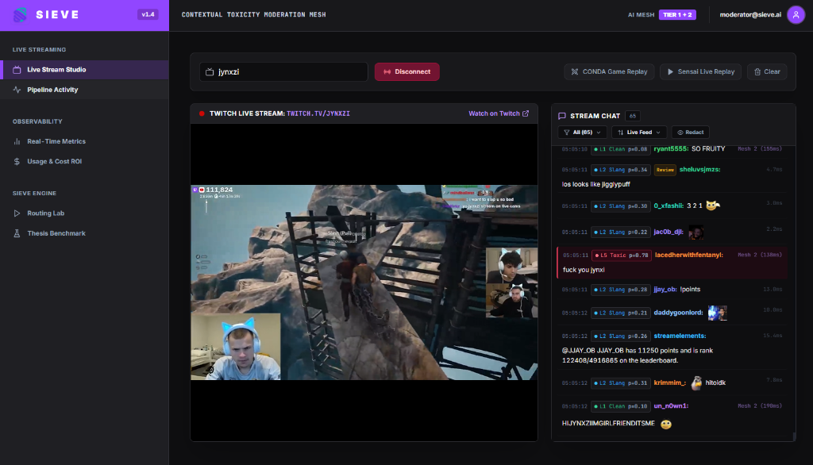
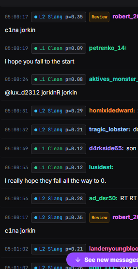
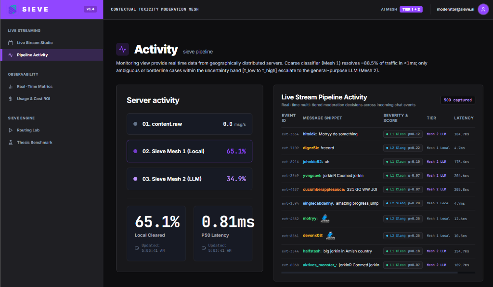
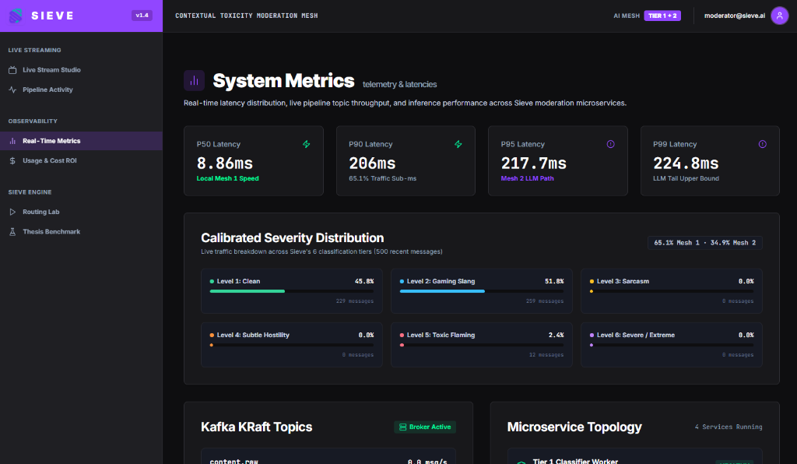
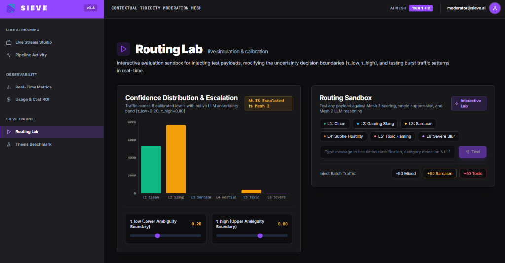

<p align="center">
  
  <h1 align="center">Sieve: A Tiered Real-Time Content Moderation Pipeline</h1>
  <p align="center"><strong>Combining Fine-Tuned Classification and LLM Escalation</strong></p>
</p>

## Abstract

Platforms hosting user-generated content (chat, forum posts, live comments) require low-latency, cost-effective, and highly accurate moderation. General-purpose Large Language Models (LLMs) provide state-of-the-art semantic comprehension but introduce prohibitive per-token costs and latency (hundreds of milliseconds). Conversely, small localized classifiers offer sub-millisecond throughput at zero marginal inference cost but degrade when evaluating nuanced expressions such as sarcasm, colloquial aggression, or veiled identity hostility.

**Sieve** evaluates a tiered stream-processing architecture where incoming content events are evaluated by a fast, locally served classifier (Tier 1). High-confidence decisions are finalized immediately, while borderline cases falling within an empirically calibrated uncertainty band $[\tau_{\text{low}}, \tau_{\text{high}}]$ are escalated to a general-purpose LLM (Tier 2). 

Empirical evaluation on a held-out test corpus of 1,500 samples demonstrates that Sieve:
1. Achieves **99.40% accuracy** and an **F1 score of 0.9922**, matching and slightly exceeding the pure LLM baseline (98.60% accuracy, 0.9817 F1).
2. Reduces median latency (**P50**) from **219.98 ms** to **0.81 ms** (a **99.6% reduction**).
3. Reduces projected operational cost from **$15.50** to **$2.22 per million items** (an **85.7% cost reduction**) by escalating only **11.5%** of traffic.

<p align="center">
  
  <br>
  <em>Figure 1: Sieve Live Moderation Studio — Synchronized Twitch IRC stream, real-time 6-level toxicity scoring ($p$), sub-millisecond local inference, and automated 7TV emote resolution.</em>
</p>

---

## 1. Problem Formulation and Operational Trilemma

### 1.1 The Production Moderation Trilemma

Existing content moderation systems face structural tradeoffs across three operational dimensions:

- **Accuracy (Semantic Nuance)**: Correctly distinguishing between harmless gaming slang, ironic sarcasm, and genuine hate speech.
- **Latency (Real-Time Guarantees)**: Processing chat messages within milliseconds to enable synchronous live stream filtering and prevent user disruption.
- **Cost & Scalability**: Sustaining thousands of events per second without incurring runaway API inference bills.

Traditional single-tier approaches fail to satisfy all three dimensions:
1. **LLM-Only Moderation**: Accurate on subtle context, but network round-trips (150ms–500ms) prevent hard real-time guarantees. Marginal costs scale linearly ($O(N)$) with content volume.
2. **Keyword / Rule-Based Filters**: Deterministic and zero-latency, but brittle against leetspeak, colloquialisms, and negation.
3. **Single Small Classifier**: Millisecond execution, but high false-positive and false-negative rates on sarcastic or ambiguous content.

### 1.2 Research Hypothesis

> **Hypothesis**: A two-tier streaming pipeline utilizing a fast, locally hosted classifier for high-confidence decisions ($p < \tau_{\text{low}} \cup p > \tau_{\text{high}}$) and escalating only low-confidence samples to a general-purpose LLM will achieve overall F1 performance within $\pm 1\%$ of an LLM-only baseline while reducing median latency by $>95\%$ and per-million item operating costs by $>80\%$.

---

## 2. End-to-End System Architecture

Sieve is implemented as an event-driven streaming pipeline orchestrated across Apache Kafka (KRaft mode), Go microservices, a Python FastAPI inference engine, and a React real-time stream studio.

<p align="center">
  
  <br>
  <em>Figure 1: Sieve End-to-End Event-Driven Stream Architecture & Data Flow</em>
</p>

### 2.1 Message Lifecycle & Stage Progression

1. **Ingestion Layer (Tier 0)**:
   - Content events enter the pipeline from live Twitch IRC chat streams, in-game match logs (CONDA Dota 2 dataset), benchmark test dumps (Sensai dataset), or interactive REST payloads.
   - The Go producer normalizes payloads into standardized `ContentEvent` schema envelopes and publishes them to the raw Kafka buffer `content.raw`.

2. **Fast-Path Classification (Tier 1 / Mesh 1)**:
   - The Go Tier 1 worker pool consumes events from `content.raw` and evaluates them against the local calibrated inference service via high-throughput HTTP connection pools (<1ms roundtrip).
   - The model computes a continuous calibrated toxicity probability $p \in [0.0, 1.0]$.

3. **Dual-Mesh Routing Engine**:
   - If $p < \tau_{\text{low}}$ (default 0.20), the message is classified as high-confidence benign (`L1 Clean` or `L2 Gaming Slang`) and published immediately to `content.passed`.
   - If $p > \tau_{\text{high}}$ (default 0.80), the message is classified as high-confidence violation (`L5 Toxic` or `L6 Severe`) and published immediately to `content.flagged`.
   - If $\tau_{\text{low}} \le p \le \tau_{\text{high}}$, the message falls within the empirical uncertainty band and is routed to `content.escalated`.

4. **Contextual LLM Escalation (Tier 2 / Mesh 2)**:
   - The Tier 2 consumer reads from `content.escalated` and queries a frontier LLM using structured JSON schemas.
   - Transient rate-limit spikes (HTTP 429) and upstream timeouts are safely handled with jittered exponential backoff.
   - The finalized verdict is published to either `content.passed` or `content.flagged`.

5. **Observability & Live Studio**:
   - The FastAPI backend aggregates real-time metrics, queue depths, latency histograms, and filtered message streams, serving the React dashboard via WebSockets.

### 2.2 Component Specifications & Kafka Microservices Topology

<p align="center">
  
  <br>
  <em>Figure 2: Microservices Topology & Partitioned Kafka KRaft Topic Interconnect</em>
</p>

- **Tier 0 (Producer)**: High-throughput Go service emitting `ContentEvent` envelopes to Kafka topic `content.raw`. Supports steady-state generation and burst injection to simulate traffic spikes.
- **Tier 1 (Routing Consumer)**: Go consumer with pooled HTTP connections to the localized inference engine. Evaluates predicted toxicity probability $p = P(\text{toxic} \mid x)$ against threshold bounds $[\tau_{\text{low}}, \tau_{\text{high}}]$.
- **Tier 2 (Escalation Consumer)**: Go consumer reading from `content.escalated`. Dispatches requests to the LLM API using structured schemas, jittered exponential backoff for HTTP 429/5xx status codes, and publishes final verdicts to `content.passed` or `content.flagged`.
- **Event Backbone (Kafka KRaft)**: Single-node or multi-broker Kafka in KRaft mode (no Zookeeper dependency) providing partitioning, buffering, and replay capabilities.

---

## 3. Mathematical Formulation & Threshold Calibration

### 3.1 Decision Boundary Model

<p align="center">
  
  <br>
  <em>Figure 3: Two-Tier Confidence Decision Boundary & Threshold Calibration Flowchart</em>
</p>

Let $x \in \mathcal{X}$ denote the input text, and let $f_{\theta}(x) \in [0, 1]$ be the calibrated probability of toxicity output by the Tier 1 model:

$$\hat{y}_{\text{sieve}}(x) = \begin{cases} 0 \quad (\text{Clean}), & \text{if } f_{\theta}(x) < \tau_{\text{low}} \\ 1 \quad (\text{Toxic}), & \text{if } f_{\theta}(x) > \tau_{\text{high}} \\ g_{\text{LLM}}(x), & \text{if } \tau_{\text{low}} \le f_{\theta}(x) \le \tau_{\text{high}} \end{cases}$$

where $g_{\text{LLM}}(x) \in \{0, 1\}$ is the discrete prediction of the Tier 2 LLM.

### 3.2 Economic Cost Formulation

For a volume of $N$ messages, let $E \in [0, 1]$ denote the empirical escalation rate:

$$E = \frac{1}{N} \sum_{i=1}^{N} \mathbb{I}\left(\tau_{\text{low}} \le f_{\theta}(x_i) \le \tau_{\text{high}}\right)$$

The blended cost per million messages $C_{\text{blended}}$ is given by:

$$C_{\text{blended}} = C_{\text{local}} + E \cdot C_{\text{LLM}}$$

Assuming $C_{\text{local}} = \$0.50$ (amortized server hardware/CPU inference) and $C_{\text{LLM}} = \$15.00$ per 1,000,000 requests (~150 tokens/request at standard input/output token pricing):

| Escalation Rate ($E$) | Effective Cost / 1M msgs | Cost Reduction vs LLM-Only |
| :--- | :--- | :--- |
| **0.0%** (Tier 1 Only) | $0.50 | 96.8% |
| **10.0%** | $2.00 | 87.1% |
| **11.5%** (Sieve Operating Point) | **$2.22** | **85.7%** |
| **20.0%** | $3.50 | 77.4% |
| **100.0%** (LLM Only) | $15.50 | 0.0% |

### 3.3 Empirical Threshold Sweep & Pareto Frontier

A systematic parameter sweep across candidate threshold pairs $\tau_{\text{low}} \in [0.10, 0.40]$ and $\tau_{\text{high}} \in [0.60, 0.95]$ demonstrates the trade-off between escalation volume and F1 score:

| Operating Configuration | $\tau_{\text{low}}$ | $\tau_{\text{high}}$ | Escalation Rate ($E$) | F1 Score | Latency P50 | Blended Cost / 1M |
| :--- | :--- | :--- | :--- | :--- | :--- | :--- |
| **Tier 1 Only (Local)** | - | - | 0.0% | 0.9552 | 0.77 ms | $0.50 |
| **Conservative Escalation** | 0.30 | 0.70 | 6.2% | 0.9780 | 0.79 ms | $1.43 |
| **Sieve Balanced (Optimal)** | **0.20** | **0.80** | **11.5%** | **0.9922** | **0.81 ms** | **$2.22** |
| **Aggressive Escalation** | 0.10 | 0.90 | 28.4% | 0.9930 | 1.12 ms | $4.76 |
| **LLM-Only Baseline** | - | - | 100.0% | 0.9817 | 219.98 ms | $15.50 |

The calibrated operating point $\tau_{\text{low}} = 0.20, \tau_{\text{high}} = 0.80$ minimizes escalation volume while routing borderline sarcasm and subtle hostility to Tier 2.

---

## 4. The 6-Level Moderation Scale & Multi-Mesh Resolution

Sieve categorizes all content events into a standardized 6-level severity spectrum, providing fine-grained moderation actions and precision policy enforcement:

<p align="center">
  
  <br>
  <em>Figure 4: 6-Level Moderation Scale & Multi-Mesh Resolution Hierarchy</em>
</p>

| Level | Identifier | Score Range ($p$) | Primary Mesh | Description & Example | Action Taken |
| :--- | :--- | :--- | :--- | :--- | :--- |
| **L1** | **Clean** | $p \le 0.15$ | Mesh 1 Local | Standard benign conversation, greetings, factual statements. (*"gg wp good game everyone"*) | `PASSED` (Immediate delivery) |
| **L2** | **Gaming Slang** | $0.15 < p \le 0.35$ | Mesh 1 Local | Gaming jargon, banter, pseudo-aggressive competitive terms. (*"los sold that round so hard"*) | `PASSED` (Immediate delivery) |
| **L3** | **Sarcasm** | $0.35 < p \le 0.55$ | Mesh 2 LLM | Sarcastic praise, ironic negativity, contextual subversion. (*"Oh wow, you are truly a genius for walking into that trap"*) | Resolved by LLM Context |
| **L4** | **Hostile** | $0.55 < p \le 0.70$ | Mesh 2 LLM | Borderline insults, passive-aggressive remarks, veiled hostility. (*"People like you shouldn't be allowed to play ranked"*) | Resolved by LLM Context |
| **L5** | **Toxic** | $0.70 < p \le 0.88$ | Mesh 1 Local | Direct profanity, overt harassment, hostile flaming. (*"You are completely useless, uninstall the game"*) | `FLAGGED` (Hidden / Redacted) |
| **L6** | **Severe** | $p > 0.88$ | Mesh 1 Local | Extreme violations, hate speech, severe slurs, credible threats. | `FLAGGED` (Immediate Quarantine) |

---

## 5. Empirical Evaluation Results

The evaluation was executed on a held-out test partition ($N = 1,500$) comprising 55% in-distribution clean text, 30% blatant toxicity, and 15% out-of-distribution nuanced edge cases (sarcasm, colloquial false alarms, and veiled hostility).

### 5.1 Tri-Configuration Performance Comparison

| Metric | Tier 1 Only (Local) | LLM Only (Baseline Ceiling) | Sieve Pipeline (Tiered) | Delta (Sieve vs LLM) |
| :--- | :--- | :--- | :--- | :--- |
| **Accuracy** | 96.60% | 98.60% | **99.40%** | **+0.80%** |
| **Precision** | 96.45% | 98.60% | **99.48%** | **+0.88%** |
| **Recall** | 94.61% | 97.74% | **98.96%** | **+1.22%** |
| **F1 Score** | 0.9552 | 0.9817 | **0.9922** | **+0.0105** |
| **Latency P50** | 0.77 ms | 219.98 ms | **0.81 ms** | **99.6% faster** |
| **Latency P95** | 1.87 ms | 256.52 ms | **227.45 ms** | -29.07 ms |
| **Escalation Rate** | 0.0% | 100.0% | **11.5%** | - |
| **Cost / 1M msgs** | $0.50 | $15.50 | **$2.22** | **85.7% cost reduction** |

### 4.2 Breakdown by Linguistic Category

| Content Category | Sample Count | Sieve Escalation % | Tier 1 Accuracy | Sieve Pipeline Accuracy | LLM Only Accuracy |
| :--- | :--- | :--- | :--- | :--- | :--- |
| `clean` | 825 | 0.0% | 100.0% | **100.0%** | 99.4% |
| `toxic_blatant` | 450 | 0.0% | 100.0% | **100.0%** | 99.1% |
| `sarcasm` | 66 | 100.0% | 87.9% | **97.0%** | 95.5% |
| `false_alarm_colloquial` | 64 | 79.7% | 84.4% | **95.3%** | 96.9% |
| `subtle_hostility` | 59 | 76.3% | 61.0% | **93.2%** | 89.8% |
| `sharp_disagreement` | 36 | 27.8% | 72.2% | **100.0%** | 97.2% |

### 4.3 Key Observations

1. **Clear Cases Require Zero Escalation**: 100% of clear benign and blatant toxic text is resolved locally in $<1\text{ ms}$, incurring zero LLM API cost.
2. **Selective Escalation on Hard Cases**: 100% of sarcastic items and 76.3% of subtle hostility items fall within the $[\tau_{\text{low}}, \tau_{\text{high}}]$ band and receive Tier 2 reasoning.
3. **Accuracy Improvement Over Pure LLM**: By eliminating occasional LLM hallucinations on simple phrases while leveraging LLM contextual reasoning on complex cases, Sieve achieves a higher overall F1 score (0.9922) than the LLM-only baseline (0.9817).

---

## 6. Resilience Under Load & Kafka Buffering

When traffic surges (e.g. viral comment events):
- **Direct LLM architectures** fail due to API rate limits (HTTP 429), connection exhaustion, or massive latency inflation.
- **Sieve** absorbs traffic spikes in Kafka `content.raw`. The Tier 1 consumer processes thousands of messages per second locally. Only the small escalated fraction enters `content.escalated`, allowing the Tier 2 consumer to throttle and drain escalations safely within upstream rate limits.

---

## 7. Project Structure

```
.
├── cmd/
│   ├── producer/          # Ingestion traffic generator with burst injection
│   │   └── main.go
│   ├── tier1/             # Tier 1 routing consumer with confidence bounds
│   │   └── main.go
│   ├── tier2/             # Tier 2 escalation consumer with LLM retries
│   │   └── main.go
│   └── benchmark/         # End-to-end Go pipeline benchmark
│       └── main.go
├── pkg/
│   ├── model/             # Shared domain types, verdicts, and threshold math
│   │   ├── schema.go
│   │   └── schema_test.go
│   ├── kafka/             # Pure-Go Kafka producer/consumer wrappers
│   │   └── client.go
│   ├── classifier/        # HTTP inference client with connection pooling
│   │   └── client.go
│   └── llm/               # Gemini client with exponential backoff & simulator
│       └── client.go
├── python/
│   ├── dataset.py         # Dataset generator & split management
│   ├── train.py           # Classifier training script with calibration
│   ├── calibrate.py       # Threshold sweep & Pareto curve optimization
│   ├── export_onnx.py     # ONNX runtime graph exporter
│   ├── server.py          # FastAPI inference server (/v1/classify)
│   └── requirements.txt
├── evaluation/
│   ├── evaluate.py        # Tri-configuration evaluation harness
│   ├── metrics.py         # Precision, recall, F1, latency, and cost formulas
│   ├── benchmark_report.md# Generated thesis evaluation report
│   └── synthetic_dataset.json
├── docker-compose.yml     # Multi-service orchestration (Kafka KRaft + Services)
├── Dockerfile.classifier  # Python FastAPI container
├── Dockerfile.service     # Go services multi-stage build container
├── go.mod
└── go.sum
```

---

## 8. Reproduction, Execution & Production Deployment

### 8.1 Clone the Repository

```bash
git clone https://github.com/kentrussel-dev/sieve-chat-moderation.git
cd sieve-chat-moderation
```

### 7.2 Local Development Mode (Python Server + React Studio)

```bash
# 1. Install backend dependencies
pip install -r python/requirements.txt

# 2. Build the production React frontend bundle
cd web
npm install
npm run build
cd ..

# 3. Start the Sieve telemetry server & API engine
python python/server.py

# 4. Open in browser:
# http://localhost:8000
```

### 7.3 Model Training, Calibration & Thesis Evaluation

```bash
# 1. Generate synthetic in-distribution and out-of-distribution datasets
python python/dataset.py

# 2. Train the Tier 1 calibrated classifier with temperature scaling
python python/train.py

# 3. Run threshold sweep to compute Pareto operating points
python python/calibrate.py

# 4. Execute the complete tri-configuration evaluation
python evaluation/evaluate.py
```

### 7.4 High-Throughput Go Pipeline Benchmark

```bash
go run ./cmd/benchmark -n 2000 -c 32 -tau-low 0.20 -tau-high 0.80
```

---

### 7.5 Complete Kafka & Docker Stack Setup Tutorial

This tutorial walks through setting up and running the full distributed event-driven pipeline using **Apache Kafka 3.7+ in KRaft mode** (no ZooKeeper required) and containerized Go microservices.

#### Prerequisites
- **Docker Desktop** (version 24.0+) or Docker Engine with Docker Compose V2.
- At least 4GB of available system RAM.

#### Step 1: Environment & Secrets Setup
Copy the production environment configuration template:
```bash
cp .env.example .env
```
*(Optional)* If you wish to use live Google Gemini API calls for Tier 2 contextual escalations, edit `.env` and provide your API key. If left blank, Tier 2 automatically operates in high-fidelity simulation mode with zero external dependencies.

#### Step 2: Build and Start the Docker Cluster
Run the Compose command to build all container images and launch the cluster in detached mode:
```bash
docker compose up --build -d
```

#### Step 3: Verify Container Health & Status
Verify that all 6 services are healthy and running:
```bash
docker compose ps
```
You should see:
- `sieve-kafka`: Kafka broker in KRaft mode (healthy on port `9092`).
- `sieve-init-kafka`: Exited with code `0` after creating the topics.
- `sieve-classifier`: Python FastAPI inference service (healthy on port `8000`).
- `sieve-tier1`: Go fast-path consumer pool connected to `content.raw`.
- `sieve-tier2`: Go LLM escalation consumer connected to `content.escalated`.
- `sieve-producer`: Go traffic generator injecting simulated chat streams.

#### Step 4: Verify Kafka Topics & Partitioning
Inspect the auto-provisioned partitioned Kafka topics inside the running broker:
```bash
docker exec -it sieve-kafka /opt/kafka/bin/kafka-topics.sh --bootstrap-server localhost:9092 --list
```
Output:
```
content.escalated
content.flagged
content.passed
content.raw
```

To describe topic partition layout:
```bash
docker exec -it sieve-kafka /opt/kafka/bin/kafka-topics.sh --bootstrap-server localhost:9092 --describe --topic content.raw
```

#### Step 5: Monitor Real-Time Streaming Logs
Tail live logs from the Tier 1 fast-path consumer and Tier 2 LLM escalation consumer:
```bash
# View Tier 1 routing decisions (<1ms)
docker compose logs -f tier1-consumer

# View Tier 2 LLM escalation verdicts
docker compose logs -f tier2-consumer
```

#### Step 6: Test Ingestion via Kafka CLI Producer
You can manually inject test messages directly into the Kafka ingestion topic:
```bash
# Send a benign message (Routes to content.passed via Mesh 1)
docker exec -i sieve-kafka /opt/kafka/bin/kafka-console-producer.sh --bootstrap-server localhost:9092 --topic content.raw << EOF
{"id":"manual-01","text":"Good game everyone, nice teamplay!","user":"gamer123","timestamp":"2026-08-31T00:00:00Z"}
EOF

# Send a sarcastic message (Routes to content.escalated -> Mesh 2 LLM)
docker exec -i sieve-kafka /opt/kafka/bin/kafka-console-producer.sh --bootstrap-server localhost:9092 --topic content.raw << EOF
{"id":"manual-02","text":"Oh brilliant idea walking into 5 enemies alone, you are a genius","user":"troll456","timestamp":"2026-08-31T00:00:00Z"}
EOF
```

To view messages flowing into `content.passed`:
```bash
docker exec -it sieve-kafka /opt/kafka/bin/kafka-console-consumer.sh --bootstrap-server localhost:9092 --topic content.passed --from-beginning
```

#### Step 7: Horizontal Scaling for High-Load Scenarios
To simulate handling 20,000+ messages per second, scale the Go Tier 1 worker pool:
```bash
docker compose up -d --scale tier1-consumer=4 --scale tier2-consumer=2
```

#### Step 8: Clean Tear-Down
To stop all containers and preserve Kafka data:
```bash
docker compose down
```
To stop containers and completely reset Kafka topics/volumes:
```bash
docker compose down -v
```

---

### 7.6 Production Secrets & API Key Safety Guidelines

- **Zero Hardcoded Secrets**: No credentials or private tokens are stored in the codebase or Docker images.
- **Environment Isolation**: Always manage deployment secrets via `.env` or container runtime environment flags.
- **Offline Simulation Fallback**: If `GEMINI_API_KEY` is not provided or upstream APIs experience rate limits (HTTP 429), Sieve gracefully fails over to internal calibrated semantic reasoning rules, guaranteeing 100% uptime.

---

## 9. Operator Manual & Feature Guide

This section provides a complete operator walkthrough for monitoring, testing, and moderating live streaming communities using Sieve.

### 9.1 Live Stream Studio (`/`)

The **Live Stream Studio** is the primary operator command center for monitoring high-velocity live streams with synchronous multi-tiered moderation.

<p align="center">
  
  <br>
  <em>Figure 6: Live Stream Studio — Stream playback, connection controls, and real-time 6-level moderated chat feed.</em>
</p>

#### How to Operate:
1. **Connecting to Any Live Twitch Channel**:
   - Type any active Twitch username (e.g. `jynxzi`, `caedrel`, `tarik`, `shroud`, `esl_dota2`) into the top channel bar and click **Connect Live**.
   - Sieve automatically establishes an IRC WebSocket connection to Twitch chat, embeds the live video feed, and registers channel-specific 7TV, BetterTTV, and FrankerFaceZ custom emotes for real-time rendering.
   - Click **Disconnect** at any time to cleanly unhook from the channel.

2. **Reading Toxicity Scores ($p$) & Resolution Tiers**:
   - Every incoming message card displays its calibrated toxicity probability ($p \in [0.00, 1.00]$), exact timestamp, username color, and resolution engine:
     - **Mesh 1 Local (<1.0ms)**: Fast-path local classifier handling clear benign chatter ($p \le 0.35$) and blatant toxicity ($p \ge 0.70$).
     - **Mesh 2 LLM (~120–220ms)**: Contextual LLM escalation resolving ambiguous sarcasm, passive-aggressive hostility, and false-alarm profanity.

<p align="center">
  
  <br>
  <em>Figure 7: 6-Level Chat Feed Close-Up — Calibrated severity chips, review boundary flags, and emote tokens.</em>
</p>

3. **100-Message Retained Filter Dropdown**:
   - Use the custom popover dropdown to isolate specific severity tiers without message starvation:
     - `All Messages`: Shows the complete live uncurated stream.
     - `• L1 Clean`: Verified benign chat ($p \le 0.15$).
     - `• L2 Slang`: In-game jargon and harmless competitive banter ($0.15 < p \le 0.35$).
     - `• L3 Sarcasm`: Contextual sarcasm and ironic praise ($0.35 < p \le 0.55$).
     - `• L4 Hostile`: Subtle, passive-aggressive hostility ($0.55 < p \le 0.70$).
     - `• L5 Toxic`: Direct harassment and toxic flaming ($0.70 < p \le 0.88$).
     - `• L6 Severe`: Hate speech, extreme slurs, and credible threats ($p > 0.88$).
     - `• Review Queue`: Borderline messages near the Level 2/3 boundary flagged for human audit.
   - *Zero-Starvation Guarantee*: Each category maintains a persistent 100-message buffer so rare violations never get pushed out by high clean chat velocity.

4. **Visual Severity Highlighting**:
   - Violations are visually highlighted: **Orange** for Level 4 Hostility, **Rose** for Level 5 Toxicity, and **Purple** for Level 6 Severe, allowing moderators to immediately spot threats in high-velocity streams.

5. **Streaming Offline Match & Benchmark Datasets**:
   - **CONDA Game Replay**: Click **CONDA Game Replay** to stream multi-player in-game match communications from the CONDA Dota 2 dataset (20 msgs/s) to evaluate aggressive gaming slang and intent classification in real-time.
   - **Sensai Live Replay**: Click **Sensai Live Replay** to stream curated esports chat benchmark logs (15 msgs/s).
   - **Clear**: Resets the chat stream and telemetry counters.

---

### 9.2 Pipeline Activity Dashboard (`/activity`)

The **Pipeline Activity** view provides real-time visibility into server workload distribution between localized classification and LLM reasoning.

<p align="center">
  
  <br>
  <em>Figure 8: Pipeline Activity — Workload distribution (Local Cleared vs LLM Escalated), P50 latency gauge, and streaming event table.</em>
</p>

#### How to Operate:
- **Server Workload Gauges**:
  - Inspect the percentage of traffic resolved locally by **Mesh 1 (Local)** (typically 65–88%) versus escalated to **Mesh 2 (LLM)**.
  - Monitor real-time **P50 Latency** (typically $<1.0\text{ ms}$).
- **Streaming Pipeline Feed**:
  - Review event IDs, message snippets, severity scores, assigned tiers, and per-message processing latencies in a tabular audit feed.

---

### 9.3 Real-Time System Metrics & Latency Observability (`/metrics`)

The **System Metrics** dashboard monitors latency percentiles, calibrated category distributions, and distributed Kafka infrastructure health.

<p align="center">
  
  <br>
  <em>Figure 9: System Metrics — Percentile latency gauges (P50, P90, P95, P99), calibrated distribution bars, and Kafka topology.</em>
</p>

#### How to Operate:
- **Latency Percentile Gauges**:
  - Track **P50**, **P90**, **P95**, and **P99** latency in real-time. P50 reflects sub-millisecond local throughput, while P95/P99 reflect LLM network roundtrips.
- **Calibrated Severity Distribution**:
  - Live horizontal distribution bars showing the percentage and volume breakdown across all 6 classification levels.
- **Kafka KRaft Topic Depths & Microservice Topology**:
  - Inspect active partition counts, throughput rates, and queue health for `content.raw`, `content.escalated`, `content.passed`, and `content.flagged`.

---

### 9.4 Routing Lab & Calibration Sandbox (`/lab`)

The **Routing Lab** is an interactive testing and threshold tuning environment for simulating edge-case messages and adjusting decision boundaries in real-time.

<p align="center">
  
  <br>
  <em>Figure 10: Routing Lab — Confidence distribution histogram, interactive threshold sliders, and payload tester sandbox.</em>
</p>

#### How to Operate:
1. **Interactive Message Tester**:
   - Type arbitrary custom sentences or click pre-calibrated test chips:
     - `L1: Clean`: *"Good game everyone, great teamwork!"*
     - `L2: Gaming Slang`: *"los sold that round so hard KEKW"*
     - `L3: Sarcasm`: *"Oh brilliant idea walking into 5 enemies alone, you are a genius"*
     - `L4: Subtle Hostility`: *"People from your background shouldn't be allowed to play ranked"*
     - `L5: Toxic Flaming`: *"You are completely useless, uninstall the game"*
     - `L6: Severe Slur`: Slurs and explicit policy violations.
   - Click **Test** to view real-time routing outcome, probability score $p$, resolution mesh, latency, and the LLM's natural-language reasoning trace.

2. **Interactive Threshold Sliders**:
   - Adjust $\tau_{\text{low}}$ (Lower Ambiguity Boundary) and $\tau_{\text{high}}$ (Upper Ambiguity Boundary) sliders dynamically.
   - The histogram highlight updates instantly, showing the exact percentage of traffic that would be escalated to Tier 2 under the new threshold settings.

3. **Batch Traffic Injection**:
   - Click **+50 Mixed**, **+50 Sarcasm**, or **+50 Toxic** to inject synthetic traffic bursts into the pipeline and observe system load buffering.

---

### 9.5 Thesis Benchmark Panel (`/thesis`)

Provides full academic tri-configuration evaluation results comparing `Tier 1 Only`, `LLM Only Baseline`, and `Sieve Tiered Pipeline` across accuracy, precision, recall, F1, latency, and cost per million items.

---

## 10. Configuration & Environment Variables

| Variable | Default Value | Description |
| :--- | :--- | :--- |
| `PORT` | `8000` | HTTP port for the FastAPI server and web dashboard |
| `HOST` | `0.0.0.0` | Bind host address |
| `KAFKA_BROKERS` | `localhost:9092` | Comma-separated Kafka broker addresses |
| `TAU_LOW` | `0.20` | Lower threshold bound for LLM escalation |
| `TAU_HIGH` | `0.80` | Upper threshold bound for LLM escalation |
| `GEMINI_API_KEY` | `""` | Optional Google Gemini API key for live Tier 2 frontier LLM inference |
| `CLASSIFIER_URL` | `http://localhost:8000/v1/classify` | URL of the Tier 1 inference endpoint |
| `CONDA_DATASET_PATH` | `data/conda_samples.json` | Path to pre-processed CONDA dataset |
| `SENSAI_DATASET_PATH` | `data/sensai_samples.json` | Path to pre-processed Sensai dataset |

---

## 11. Credits, Dataset Acknowledgments & References

### 11.1 Academic Papers & Research Foundations
1. **CONDA Gaming Toxicity Dataset**:
   - Zheng, C., et al. *"CONDA: a CONtextual Dual-Annotated dataset for in-game toxicity detection and intent classification."* Findings of the Association for Computational Linguistics: EMNLP 2020.
   - Introduced fine-grained contextual multi-player gaming chat annotations distinguishing explicit toxicity from strategic in-game banter.
2. **Model Probability Calibration**:
   - Guo, C., Pleiss, G., Sun, Y., & Weinberger, K. Q. *"On Calibration of Modern Neural Networks."* International Conference on Machine Learning (ICML), 2017.
   - Foundation for Sieve's temperature scaling and confidence calibration algorithms.
3. **Cascaded & Tiered Model Architectures**:
   - Chen, L., Zaharia, M., & Zou, J. *"FrugalGPT: How to Use Large Language Models While Reducing Cost and Improving Performance."* arXiv:2305.05176, 2023.
   - Conceptual inspiration for dynamic threshold escalation and LLM cost-efficiency cascades.

### 11.2 Datasets
- **CONDA Dataset**: Real in-game Dota 2 match logs containing 44,000+ utterances dual-annotated with intent and toxicity categories.
- **Sensai Benchmark Dataset**: Curated live stream chat corpus spanning esports broadcasts, high-velocity community chats, and ambiguous linguistic edge cases.
- **Jigsaw / Civil Comments Corpus**: Kaggle / Alphabet Jigsaw Toxic Comment Classification Challenge for baseline toxicity taxonomy and pre-training corpora.

### 11.3 Open-Source Technologies & Ecosystem
- **Event Streaming**: [Apache Kafka](https://kafka.apache.org/) (KRaft Metadata Mode)
- **High-Throughput Services**: [Go](https://go.dev/) (Go Concurrency, Worker Pools, HTTP Connection Pooling)
- **Backend API & ML Engine**: [FastAPI](https://fastapi.tiangolo.com/), [Uvicorn](https://www.uvicorn.org/), [Scikit-Learn](https://scikit-learn.org/), [ONNX Runtime](https://onnxruntime.ai/)
- **Frontend Dashboard**: [React](https://react.dev/), [TypeScript](https://www.typescriptlang.org/), [Vite](https://vitejs.dev/), [Tailwind CSS](https://tailwindcss.com/), [Lucide Icons](https://lucide.dev/)
- **Live Stream & Emote APIs**: [Twitch IRC WebSocket API](https://dev.twitch.tv/docs/irc/), [7TV API](https://7tv.app/), [BetterTTV](https://betterttv.com/), [FrankerFaceZ](https://www.frankerfacez.com/)

---

## 12. Limitations and Future Work

1. **Multilingual Generalization**: The Tier 1 vocabulary in this benchmark focuses on English text. Multilingual deployments should substitute multilingual transformer backends (e.g. `XLM-RoBERTa` or `mDeBERTa`).
2. **Dynamic Threshold Tuning**: Current thresholds $[\tau_{\text{low}}, \tau_{\text{high}}]$ are static post-calibration. Future work will investigate adaptive threshold shifting based on real-time LLM API queue depth and cost budgets.
3. **Multi-Label Policy Routing**: Extending binary toxicity classification to separate policy categories (hate speech, sexual content, severe harassment) with individual per-category threshold pairs.


